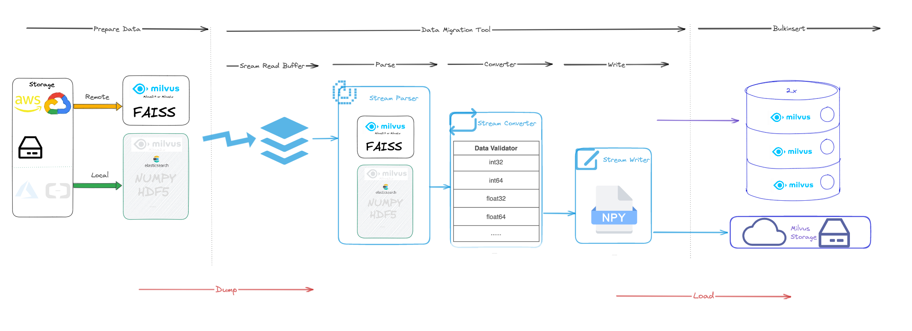

# Milvus Migration: migrate data to Milvus 2.x

## Overview

[milvus-migration](https://github.com/zilliztech/milvus-migration) is a data migration tool for [Milvus](https://milvus.io/) that supports importing **Milvus 0.9.x ~ 1.x**/**faiss** datas to milvus 2.x.

## Architecture



## Getting started

### Prerequisites

- Operating System Requirements

| Operating System | Supported Versions |
| :--------------- | :----------------- |
| CentOS           | 7.5 or later       |
| Ubuntu LTS       | 18.04 or later     |

- Software Requirements

| Software                     | Version           |
| :--------------------------- | :---------------- |
| [Milvus](https://milvus.io/) | 0.9.x, 1.x or 2.x |
| go                           | 1.20.2 or later   |

- Data Format Support

| Source Data Type         | Target Data Type |
| :----------------------- | :--------------- |
| Milvus 0.9.x - 1.x       | Milvus 2.x       |
| Faiss (Beta)             | Milvus 2.x       |
| Milvus 2.x (in progress) | Milvus 2.x       |

### How to use this tool?

1. Download the source code and build it:

```shell
git clone git@github.com:zilliztech/milvus-migration.git
go build
```

2. After building, you will obtain the `milvus-migration` binary file. Place this file and the `migration.yaml` file in the same directory:

```text
directory
---- milvus-migration
---- migration.yaml
```

3. Run the command `dump` to dump the source data to numpy:

```shell
./milvus-migration dump
```

4. Finally, load the numpy files to Milvus 2.x successfully by using the `load` command:

```shell
./milvus-migration load
```

Add the following two lines to `~/.bashrc` file:

```bash
export MILVUSDM_PATH='/home/$user/milvusdm'
export LOGS_NUM=0
```

## Examples of migration.yaml

### Migrate Milvus 0.9.x ~ 1.x(sqlite) to Milvus 2.x

```yaml
dumper:
  worker:
    limit: 20
    workMode: milvus1x

    reader:
      bufferSize: 1024 # unit is KB

    writer:
      bufferSize: 1024 # unit is KB

loader:
  worker:
    limit: 20

source:
  mode: local

  local:
    meta:
      mode: sqlite
      sqliteFile: /db/meta.sqlite

    tablesDir: /db/tables/

target:
  mode: remote

  remote:
    outputDir: output/ # don't start with /

    cloud: aws
    endpoint: 127.0.0.1:9000
    region: ap-southeast-1
    bucket: a-bucket
    ak: minioadmin
    sk: minioadmin
    useIAM: false
    useSSL: false
    checkBucket: true

  milvus2x: # milvus2x connect info
    endpoint: xxxxxx:19530
    username: xxxxx
    password: xxxxx
```

### Migrate milvus 0.9.x ~ 1.x(mysql) to Milvus 2.x

```yaml
dumper:
  worker:
    limit: 20 # dumper thread concurrency
    workMode: milvus1x

    reader:
      bufferSize: 1024 # unit is KB

    writer:
      bufferSize: 1024 # unit is KB

loader:
  worker:
    limit: 20 # loader thread concurrency

source:
  mode: local

  local:
    meta:
      mode: mysql
      mysql:
        url: "user:password@tcp(localhost:3306)/milvus?charset=utf8mb4&parseTime=True&loc=Local"

    tablesDir: /db/tables/

target:
  mode: remote

  remote:
    outputDir: output/ # don't start with /

    cloud: aws
    endpoint: 127.0.0.1:9000
    region: ap-southeast-1
    bucket: a-bucket
    ak: minioadmin
    sk: minioadmin
    useIAM: false
    useSSL: false
    checkBucket: true

  milvus2x: # milvus2x connect info
    endpoint: xxxxxx:19530
    username: xxxxx
    password: xxxxx
```

### Migrate Faiss to Milvus 2.x

```yaml
dumper:
  worker:
    limit: 20
    workMode: faiss

    reader:
      bufferSize: 1024 # unit is KB

    writer:
      bufferSize: 1024 # unit is KB

loader:
  worker:
    limit: 20

source:
  mode: local

  local:
    faissFile: /data/faiss.index

target:
  mode: remote

  remote:
    outputDir: output/ # don't start with /

    cloud: aws
    endpoint: 127.0.0.1:9000
    region: ap-southeast-1
    bucket: a-bucket
    ak: minioadmin
    sk: minioadmin
    useIAM: false
    useSSL: false
    checkBucket: true

  milvus2x: # milvus2x connect info
    endpoint: xxxxxx:19530
    username: xxxxx
    password: xxxxx

  create:
    collection:
      name: test
      shardsNum: 2
      dim: 512
      metricType: L2
```

## migration.yaml reference

### `dumper`

| Parameter                       | Description                                         | Example                                                         |
| ------------------------------- | --------------------------------------------------- | --------------------------------------------------------------- |
| dumper.worker.workMode          | Work mode for milvus-migration dumper               | milvus1x: dump data from Milvus1.x; faiss: dump data from Faiss |
| dumper.worker.limit             | The number of dumper threads to run concurrently    | 20: means to dump 20 segment files simultaneously               |
| dumper.worker.reader.bufferSize | The buffer size for each segment file reader, in KB | 1024                                                            |
| dumper.worker.writer.bufferSize | The buffer size for each segment file writer, in KB | 1024                                                            |

### `loader`

| Parameter           | Description                   | Example                                           |
| ------------------- | ----------------------------- | ------------------------------------------------- |
| loader.worker.limit | Concurrency of loader threads | 20: means load 20 segments files at the same time |

### `source`

| parameter                   | description                                       | example                                                                             |
| --------------------------- | ------------------------------------------------- | ----------------------------------------------------------------------------------- |
| source.mode                 | Where the source files are read from              | local: read files from local disk, remote: read files from S3                       |
| source.local.faissFile      | faissFile position                                | /db/faiss.index                                                                     |
| source.local.meta.mode      | Where to read the source meta information from    | sqlite: read meta information from SQLite; mysql: read meta information from MySQL  |
| source.local.meta.mysql.url | Position of the Milvus 0.9.x~1.x meta.sqlite file | "user:password@tcp(localhost:3306)/milvus?charset=utf8mb4&parseTime=True&loc=Local" |
| source.local.meta.tablesDir | Position of the Milvus 0.9.x~1.x tables directory | /home/${user}/milvus/db/tables                                                      |

### `target`

| parameter                           | description                                          | example                                                                   |
| ----------------------------------- | ---------------------------------------------------- | ------------------------------------------------------------------------- |
| target.mode                         | Where to store the dumped files                      | local: store dumped files on local disk; remote: store dumped files on S3 |
| target.remote.outputDir             | Directory path in bucket where to store files        | output/                                                                   |
| target.remote.cloud                 | Storage in Milvus 2.x                                | aws (if using Minio, use aws), GCP, or Azure                              |
| target.remote.endpoint              | Endpoint of the Milvus 2.x storage                   | 127.0.0.1:9000                                                            |
| target.remote.region                | Region of the Milvus 2.x storage                     | If using local Minio, can use any value                                   |
| target.remote.bucket                | Bucket of the Milvus 2.x storage                     | Must use the same bucket as configured in milvus.yaml for Milvus 2.x      |
| target.remote.ak                    | Access Key of the Milvus 2.x storage                 | minioadmin                                                                |
| target.remote.sk                    | Secret Key of the Milvus 2.x storage                 | minioadmin                                                                |
| target.remote.useIAM                | Whether to use IAM Role to connect to Milvus 2.x     | false                                                                     |
| target.remote.useSSL                | Whether to use SSL when connecting to Milvus 2.x     | For local Minio, use false; for remote S3, use true                       |
| target.remote.checkBucket           | Whether to check if the bucket exists in the storage | True to check if you can connect to the Milvus 2.x storage                |
| target.milvus2x.endpoint            | Endpoint of Milvus 2.x                               | xxxxxx:19530                                                              |
| target.milvus2x.username            | Username of Milvus 2.x                               | root                                                                      |
| target.milvus2x.password            | Password of Milvus 2.x                               | xxxxxxx                                                                   |
| target.create.collection.name       | milvus2.x createCollection param name                | collection_name                                                           |
| target.create.collection.shardsNum  | milvus2.x createCollection param shardsNum           | default is 2                                                              |
| target.create.collection.dim        | milvus2.x createCollection param dim                 | must same with faiss.index data's dim                                     |
| target.create.collection.metricType | milvus2.x createCollection param metricType          | metricType: L2 or IP now                                                  |

## Todo

- [ ] Mivlus 2.x to Milvus 2.x
- [ ] Supports binary vectors
